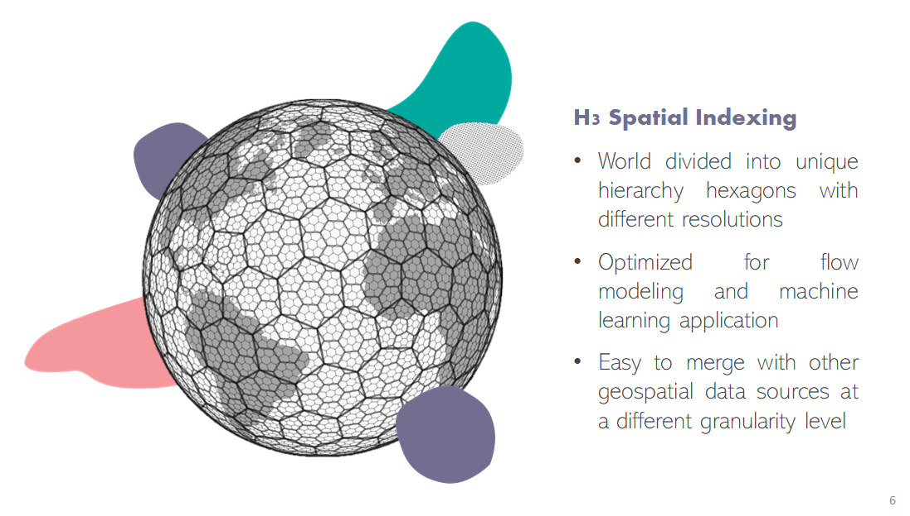

[](
https://join.slack.com/t/kuwala-community/shared_invite/zt-l5b2yjfp-pXKFBjbnl7_P3nXtwca5ag)

### The Vision of a Global Liquid Data Economy

With Kuwala, we want to enable the global liquid data economy. You probably also envision a future of smart cities, 
autonomously driving cars, and sustainable living. For all of that, we need to leverage the power of data. 
Unfortunately, many promising data projects fail, however. That's because too many resources are necessary for 
gathering and cleaning data. Kuwala supports you as a data engineer, data scientist, or business analyst to create a 
holistic view of your ecosystem by integrating third-party data seamlessly.

### How Kuwala works

Kuwala explicitly focuses on integrating third-party data, so data that is not under your company's influence, e.g., 
weather or population information. To easily combine several domains, we further narrow it down to data with a 
geo-component which still includes many sources. For matching data on different aggregation levels, such as POIs to a 
moving thunderstorm, we leverage [Uber's H3](https://eng.uber.com/h3/) spatial indexing.



Pipelines wrap individual data sources. Within the pipeline, raw data is cleaned and preprocessed. Then, the 
preprocessed data is loaded into a graph to establish connections between the different data points. Based on the graph, 
Kuwala will create a data lake from which you can load the data to a data warehouse, for example. Alternatively, it 
will also be possible to query the graph through a GraphQL endpoint.

---

### Quickstart with Docker (OSM and population data)

#### Prerequisites

Installed version of *Python3*, *Docker* and 
*docker-compose* ([*Go here for instructions*](https://docs.docker.com/compose/install/))

***Note***: We recommend giving Docker at least 8 GB of RAM


#### Process data

1. From inside the root directory, change directory to `kuwala/scripts`

```zsh 
cd kuwala/scripts
```

2. Build CLI and Docker images

```zsh
sh initialize_components.sh
```

3. Run CLI to download and process data

```zsh 
sh run_cli.sh
```

#### Query data

Currently, you can query the graph database directly using Cypher. To launch the Neo4j instance run the following:

1. From inside the root directory, change directory to `kuwala/`

```zsh 
cd kuwala/
```

2. Launch Neo4j

```zsh
docker-compose --profile core up
```

There already is a PR ([#55](https://github.com/kuwala-io/kuwala/pull/55)) open for a Jupyter Notebook environment with convenience functions to query and visualize the 
data.

---

### How you can contribute

#### Be part of our community

The best first step to get involved is to 
[join](https://join.slack.com/t/kuwala-community/shared_invite/zt-l5b2yjfp-pXKFBjbnl7_P3nXtwca5ag) the Kuwala Community 
on Slack. There we discuss everything related to data integration and new pipelines. Every pipeline will be open-source. 
We entirely decide, based on you, our community, which sources to integrate. You can reach out to us on Slack or 
[email](mailto:community@kuwala.io) to request a new pipeline or contribute yourself. 

#### Contribute to the project

If you want to contribute 
yourself, you can use your choice's programming language and database technology. We have the only requirement that it 
is possible to run the pipeline locally and use [Uber's H3](https://eng.uber.com/h3/) functionality to handle 
geographical transformations. We will then take the responsibility to maintain your pipeline.

*Note: To submit a pull request, please fork the project and then submit a PR to the base repo.*

### Liberating the work with data

By working together as a community of data enthusiasts, we can create a network of seamlessly integratable pipelines. 
It is now causing headaches to integrate third-party data into applications. But together, we will make it 
straightforward to combine, merge and enrich data sources for powerful models.

### What's coming next for the pipelines?
Based on the use-cases we have discussed in the community and potential users, we have identified a variety of data 
sources to connect with next:

#### Semi-structured data
Already structured data but not adapted to the Kuwala framework:

- Google Trends - https://github.com/GeneralMills/pytrends
- Instascraper - https://github.com/chris-greening/instascrape
- GDELT - https://www.gdeltproject.org/
- Worldwide Administrative boundaries - https://index.okfn.org/dataset/boundaries/
- Worldwide scaled calendar events (e.g. bank holidays, school holidays) - https://github.com/commenthol/date-holidays

#### Unstructured data
Unstructured data becomes structured data:
- Building Footprints from satellite images

#### Wishlist
Data we would like to integrate, but a scalable approach is still missing:

- Small scale events (e.g., a festival, movie premiere, nightclub events)

---

## Using existing pipelines

To use our published pipelines clone this repository and navigate to 
[`./kuwala/pipelines`](https://github.com/kuwala-io/kuwala/tree/master/kuwala/pipelines). There is a separate README 
for each pipeline on how to get started with it.

We currently have the following pipelines published:
- [`osm-poi`](https://github.com/kuwala-io/kuwala/tree/master/kuwala/pipelines/osm-poi):
  Global collection of point of interests (POIs)
- [`population-density`](https://github.com/kuwala-io/kuwala/tree/master/kuwala/pipelines/population-density): 
  Detailed population and demographic data
- [`google-poi`](https://github.com/kuwala-io/kuwala/tree/master/kuwala/pipelines/google-poi):
  Scraping API to retrieve POI information from Google (incl. popularity score)