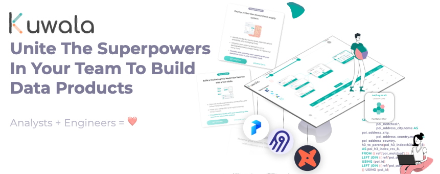
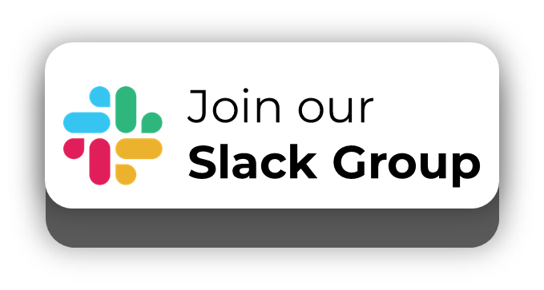
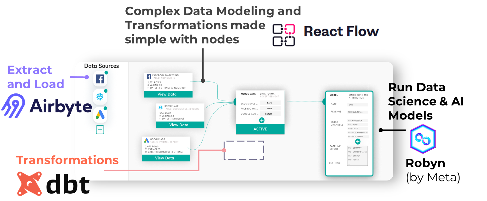

[](https://join.slack.com/t/kuwala-community/shared_invite/zt-l5b2yjfp-2cdhReNACXDkLhuh0jFzZw)




<p align="center">

<a href="https://join.slack.com/t/kuwala-community/shared_invite/zt-l5b2yjfp-2cdhReNACXDkLhuh0jFzZw"></a>
<a href="https://github.com/orgs/kuwala-io/projects/3/views/6"></a>

</p>

Kuwala is **the data workspace for BI analysts and engineers enabling
you to build powerful analytics workflows together.** We are set out to
bring **state-of-the-art data engineering tools** you love, such as
[Airbyte](https://github.com/airbytehq/airbyte),
[dbt](https://github.com/dbt-labs/dbt-core) and
[prefect](https://github.com/prefecthq/prefect) together in one
intuitive interface built with [React
Flow](https://github.com/wbkd/react-flow).

Do you want to **discuss your first contribution**, want to **learn more
in general**, or **discuss your specific use-case** for Kuwala? Just
**book a digital coffee session** with the core team
[here](https://calendly.com/kuwala_io/kuwala-community-chat).


Kuwala stands for **extendability, reproducibility, and enablement**.
Small data teams build data products fastly and collaboratively.
Analysts and engineers stay with their strengths. Kuwala is the tool
that makes it possible to keep a data project within scope while having
fun again.

-   **Kuwala Canvas runs directly on a data warehouse** = Maximum
    flexibility and no lock-in effect
-   **Engineers enable their analysts** by adding transformations and
    models via dbt or new data sources through Airbyte
-   **The node-based editor enables analyst** to build advanced data
    workflows with many data sources and transformations through simple
    drag-and-drop
-   **With models-as-a-block** the BI analyst can launch advanced
    Marketing Mix Models and attributions without knowing R or Python



### Extract and Load with Airbyte

Currently we support the following databases and data warehouses

-   ☑️ PostGres
-   ☑️ BigQuery
-   ☑️ Snowflake

For connecting and loading all your tooling data into a data warehouse,
we are integrating with Airbyte connectors. For everything related to
third-party data, such as POI and demographics data, we are building
separate data pipelines.

### Transform with dbt

To apply transformations on your data, we are integrating dbt which is
running on top of your data warehouses. Engineers can easily create dbt
models and make them reusable to the frontend. We have already a catalog
of many transformations that you can use in the canvas. The complete
documentation can be found here:
[https://docs.kuwala.io/](https://docs.kuwala.io/transformation-catalog)

### Run a Data Science Model

We are going to include open-source data science and AI models as Blocks
(e.g., [Meta's Robyn Marketing Mix
Modeling](https://github.com/facebookexperimental/Robyn)).

### Report

You can easily connect your preferred visualization tool and connect it
to a saved table on the Canvas. In the future, we make the results
exportable to Google Sheets and also available in a Medium-style
markdown editor.

------------------------------------------------------------------------

# How can I use Kuwala?

### Canvas

With the canvas you can connect to your data warehouse and start
building data pipelines. To start the canvas, simply run the following
command from inside the root directory:

``` zsh
docker-compose --profile kuwala up
```

Now open <http://localhost:3000> in your browser, and you are good to
go. 🚀

### Third-party data connectors

We currently have five pipelines for different third-party data sources
which can easily be imported into a Postgres database. The following
pipelines are integrated:

-   [Admin
    Boundaries](https://github.com/kuwala-io/kuwala/tree/master/kuwala/pipelines/admin-boundaries/README.md)
-   [Google
    POIs](https://github.com/kuwala-io/kuwala/tree/master/kuwala/pipelines/google-poi/README.md)
-   [Google
    Trends](https://github.com/kuwala-io/kuwala/tree/master/kuwala/pipelines/google-trends/README.md)
-   [OSM
    POIs](https://github.com/kuwala-io/kuwala/tree/master/kuwala/pipelines/osm-poi/README.md)
-   [Population
    Density](https://github.com/kuwala-io/kuwala/tree/master/kuwala/pipelines/population-density/README.md)

### Using Kuwala components individually

To use Kuwala's components, such as the data pipelines or the Jupyter
environment, individually, please refer to the [instructions under
`/kuwala`](https://github.com/kuwala-io/kuwala/blob/master/kuwala/README.md).

------------------------------------------------------------------------

# Use cases

-   [How to build an Uber-like analytics system with
    Kuwala](https://kuwala.io/data-pipelines/how-to-build-an-uber-like-intelligence-system-for-your-new-mobility-startup-without-a-big-data-team/)
-   [Perform location analytics for a grocery store with
    Kuwala](https://kuwala.io/case-studies/why-instant-grocery-delivery-should-follow-a-data-driven-path-like-uber-to-survive-part-1/)
-   [Querying the most granular demographics data set with
    Kuwala](https://kuwala.io/data-pipelines/querying-the-most-granular-demographics-dataset/)

------------------------------------------------------------------------

# How can I contribute?

Every new issue, question, or comment is a contribution and very
welcome! This project lives from your feedback and involvement!

## Be part of our community

The best first step to get involved is to join the [Kuwala Community on
Slack](https://join.slack.com/t/kuwala-community/shared_invite/zt-l5b2yjfp-2cdhReNACXDkLhuh0jFzZw).
There we discuss everything related to our roadmap, development, and
support.

## Contribute to the project

Please refer to our [contribution
guidelines](https://github.com/kuwala-io/kuwala/tree/master/CONTRIBUTING.md)
for further information on how to get involved.

------------------------------------------------------------------------

# Get more content about Kuwala

| Link                                                                                                                                                                                                            | Description                                                                                                                          |
|--------------------------------------------|----------------------------|
| [Blog](https://kuwala.io/blog/)                                                                                                                                                                                 | Read all our blog articles related to the stuff we are doing here.                                                                   |
| [Join Slack](https://join.slack.com/t/kuwala-community/shared_invite/zt-l5b2yjfp-2cdhReNACXDkLhuh0jFzZw)                                                                                                        | Our Slack channel with over 250 data engineers and many discussions.                                                                 |
| [Jupyter notebook - Popularity correlation](https://mybinder.org/v2/gh/kuwala-io/kuwala_examples/1def41ded01dbb67ecada9dc227c834cd93d0721?urlpath=lab%2Ftree%2Fnotebooks%2F1.%20Popularity%20Correlation.ipynb) | Open a Jupyter notebook on Binder and merge external popularity data with Uber traversals by making use of convenient dbt functions. |
| [Podcast](https://anchor.fm/kuwala-io)                                                                                                                                                                          | Listen to our community podcast and maybe join us on the next show.                                                                  |
| [Digital coffee break](https://calendly.com/kuwala_io/kuwala-community-chat?month=2022-02)                                                                                                                      | Are you looking for new inspiring tech talks? Book a digital coffee chit-chat with one member of the core team.                      |
| [Our roadmap](https://github.com/orgs/kuwala-io/projects/3/views/6)                                                                                                                                             | See our upcoming milestones and sprint planing.                                                                                      |
| [Contribution guidelines](https://github.com/kuwala-io/kuwala/tree/master/CONTRIBUTING.md)                                                                                                                      | Further information on how to get involved.                                                                                          |
