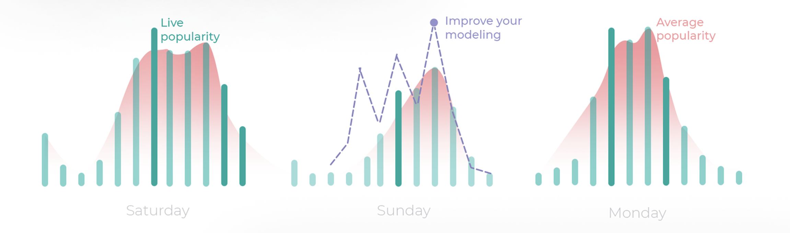

[](https://join.slack.com/t/kuwala-community/shared_invite/zt-l5b2yjfp-pXKFBjbnl7_P3nXtwca5ag)


## What is Kuwala?

Kuwala is a tool to build rich features for analytics based on clean data. It uses 
[PySpark](http://spark.apache.org/docs/latest/api/python/) in combination with 
[Parquet](http://parquet.apache.org/documentation/latest/) for data processing. The resulting clean datasets are then
loaded into a [Postgres](https://www.postgresql.org) data warehouse. We then use [dbt](https://www.getdbt.com) for fast, 
flexible, and reproducible feature generation.

## How can I use Kuwala?

There are basically 3 ways you can work with the clean data at the moment:

1. Directly write SQL queries for the Postgres data warehouse
2. Build transformations using dbt on top of Postgres
3. Jupyter notebooks with convenience functions

## Which data pipelines are available right now?

### OpenStreetMap (OSM) POIs

Points of interest are places that are physically accessible. This includes, for example, businesses, restaurants, 
schools, tourist attractions and parks. A complete list of categories and further information can be found in our 
[OSM documentation](https://github.com/kuwala-io/kuwala/tree/master/kuwala/pipelines/osm-poi). We take the daily 
updated `.pbf` files with the entire data on OSM from [Geofabrik](http://www.geofabrik.de). We filter  objects based on 
tags that are irrelevant for POIs. We then further aggregate the tags to high-level categories allowing for easy query 
building and extract other metadata such as the address, contact details, or the building footprint. By extracting and 
cleaning the data from OpenStreetMap, Kuwala has one of the largest POI databases scalable to any place in the world.

### Google POIs



Kuwala offers a scraper that retrieves all available metadata for POIs as seen on Google Search. You can verify the 
POIs from OSM and enrich them further with an hourly, standardized score for visitation frequency throughout the week.
This helps to understand the flow of people throughout a city. We do not use the Google Maps API so there is no need for 
registration. Instead, the results are generated based on search strings which can be based on OpenStreetMap (OSM) 
data. For more information, please go to the 
[complete documentation](https://github.com/kuwala-io/kuwala/tree/master/kuwala/pipelines/google-poi).

### High-Resolution Demographic Data


The high-resolution demographic data comes from Facebook's 
[Data for Good](https://dataforgood.facebook.com/dfg/docs/methodology-high-resolution-population-density-maps) 
initiative. It provides population estimates for the whole world at a granularity of roughly 30 x 30 meters for 
different demographic groups such as total, female, male or youth. It is a statistical model based on official census 
data combined with Facebook's data and satellite images. The demographic data represents the highest granularity and 
most up-to-date data of population estimates that is available. 

### H3 (Spatial Index)
H3 is a hierarchically ordered indexing method for geo-spatial data which represents the world in unique hexagons of 
different sizes (bins). H3 makes it possible to aggregate data fast on different levels and different forms. It is 
computationally efficient for databases and has applications in weighting data. One example might be weighting less 
granular data like income data with the high-resolution demographic data provided through Kuwala. H3 was developed by 
Uber. For the complete documentation please go to the [H3 Repo](https://github.com/uber/h3)

---

## Quick Start & Demo

#### Prerequisites

Installed version of *Python3*, *Docker* and 
*docker-compose v2* ([*Go here for instructions*](https://docs.docker.com/compose/install/)) or use the Binder batch in 
the next section.

***Note***: 
1) We recommend giving Docker at least 8 GB of RAM (On Docker Desktop you can go under settings -> resources)
2) If you are a Windows user, we recommend you to install the *Windows Subsystem for Linux (WSL)* and integrate docker with WSL. WSL presence is highly recommended since many automation scripts written in Unix Shell (or `.sh`) format. For WSL installation's guidance can be found [here](https://docs.microsoft.com/en-us/windows/wsl/install). We use Ubuntu on WSL for debug and testing purposes.

#### Demo correlating Uber traversals with Google popularities

[![badge](https://img.shields.io/badge/launch-demo-579ACA.svg?logo=data:image/png;base64,iVBORw0KGgoAAAANSUhEUgAAAFkAAABZCAMAAABi1XidAAAB8lBMVEX///9XmsrmZYH1olJXmsr1olJXmsrmZYH1olJXmsr1olJXmsrmZYH1olL1olJXmsr1olJXmsrmZYH1olL1olJXmsrmZYH1olJXmsr1olL1olJXmsrmZYH1olL1olJXmsrmZYH1olL1olL0nFf1olJXmsrmZYH1olJXmsq8dZb1olJXmsrmZYH1olJXmspXmspXmsr1olL1olJXmsrmZYH1olJXmsr1olL1olJXmsrmZYH1olL1olLeaIVXmsrmZYH1olL1olL1olJXmsrmZYH1olLna31Xmsr1olJXmsr1olJXmsrmZYH1olLqoVr1olJXmsr1olJXmsrmZYH1olL1olKkfaPobXvviGabgadXmsqThKuofKHmZ4Dobnr1olJXmsr1olJXmspXmsr1olJXmsrfZ4TuhWn1olL1olJXmsqBi7X1olJXmspZmslbmMhbmsdemsVfl8ZgmsNim8Jpk8F0m7R4m7F5nLB6jbh7jbiDirOEibOGnKaMhq+PnaCVg6qWg6qegKaff6WhnpKofKGtnomxeZy3noG6dZi+n3vCcpPDcpPGn3bLb4/Mb47UbIrVa4rYoGjdaIbeaIXhoWHmZYHobXvpcHjqdHXreHLroVrsfG/uhGnuh2bwj2Hxk17yl1vzmljzm1j0nlX1olL3AJXWAAAAbXRSTlMAEBAQHx8gICAuLjAwMDw9PUBAQEpQUFBXV1hgYGBkcHBwcXl8gICAgoiIkJCQlJicnJ2goKCmqK+wsLC4usDAwMjP0NDQ1NbW3Nzg4ODi5+3v8PDw8/T09PX29vb39/f5+fr7+/z8/Pz9/v7+zczCxgAABC5JREFUeAHN1ul3k0UUBvCb1CTVpmpaitAGSLSpSuKCLWpbTKNJFGlcSMAFF63iUmRccNG6gLbuxkXU66JAUef/9LSpmXnyLr3T5AO/rzl5zj137p136BISy44fKJXuGN/d19PUfYeO67Znqtf2KH33Id1psXoFdW30sPZ1sMvs2D060AHqws4FHeJojLZqnw53cmfvg+XR8mC0OEjuxrXEkX5ydeVJLVIlV0e10PXk5k7dYeHu7Cj1j+49uKg7uLU61tGLw1lq27ugQYlclHC4bgv7VQ+TAyj5Zc/UjsPvs1sd5cWryWObtvWT2EPa4rtnWW3JkpjggEpbOsPr7F7EyNewtpBIslA7p43HCsnwooXTEc3UmPmCNn5lrqTJxy6nRmcavGZVt/3Da2pD5NHvsOHJCrdc1G2r3DITpU7yic7w/7Rxnjc0kt5GC4djiv2Sz3Fb2iEZg41/ddsFDoyuYrIkmFehz0HR2thPgQqMyQYb2OtB0WxsZ3BeG3+wpRb1vzl2UYBog8FfGhttFKjtAclnZYrRo9ryG9uG/FZQU4AEg8ZE9LjGMzTmqKXPLnlWVnIlQQTvxJf8ip7VgjZjyVPrjw1te5otM7RmP7xm+sK2Gv9I8Gi++BRbEkR9EBw8zRUcKxwp73xkaLiqQb+kGduJTNHG72zcW9LoJgqQxpP3/Tj//c3yB0tqzaml05/+orHLksVO+95kX7/7qgJvnjlrfr2Ggsyx0eoy9uPzN5SPd86aXggOsEKW2Prz7du3VID3/tzs/sSRs2w7ovVHKtjrX2pd7ZMlTxAYfBAL9jiDwfLkq55Tm7ifhMlTGPyCAs7RFRhn47JnlcB9RM5T97ASuZXIcVNuUDIndpDbdsfrqsOppeXl5Y+XVKdjFCTh+zGaVuj0d9zy05PPK3QzBamxdwtTCrzyg/2Rvf2EstUjordGwa/kx9mSJLr8mLLtCW8HHGJc2R5hS219IiF6PnTusOqcMl57gm0Z8kanKMAQg0qSyuZfn7zItsbGyO9QlnxY0eCuD1XL2ys/MsrQhltE7Ug0uFOzufJFE2PxBo/YAx8XPPdDwWN0MrDRYIZF0mSMKCNHgaIVFoBbNoLJ7tEQDKxGF0kcLQimojCZopv0OkNOyWCCg9XMVAi7ARJzQdM2QUh0gmBozjc3Skg6dSBRqDGYSUOu66Zg+I2fNZs/M3/f/Grl/XnyF1Gw3VKCez0PN5IUfFLqvgUN4C0qNqYs5YhPL+aVZYDE4IpUk57oSFnJm4FyCqqOE0jhY2SMyLFoo56zyo6becOS5UVDdj7Vih0zp+tcMhwRpBeLyqtIjlJKAIZSbI8SGSF3k0pA3mR5tHuwPFoa7N7reoq2bqCsAk1HqCu5uvI1n6JuRXI+S1Mco54YmYTwcn6Aeic+kssXi8XpXC4V3t7/ADuTNKaQJdScAAAAAElFTkSuQmCC)](https://mybinder.org/v2/gh/kuwala-io/kuwala_examples/1def41ded01dbb67ecada9dc227c834cd93d0721?urlpath=lab%2Ftree%2Fnotebooks%2F1.%20Popularity%20Correlation.ipynb)


We have a notebook with which you can correlate any value associated with a geo-reference with the Google popularity 
score. In the demo, we have preprocessed popularity data and a test dataset with Uber rides in Lisbon, Portugal.

#### Run the demo

You could either use the deployed example on Binder using the badge above or run everything locally. The Binder example
simply uses Pandas dataframes and is not connecting to a data warehouse. \
To run the demo locally, launch Docker in the background and from inside the root directory run:

Linux/Mac:
```zsh 
cd kuwala/scripts && python3 initialize_core_components.py && python3 run_cli.py
```
Windows PowerShell with WSL:
1) Activate the WSL with `bash` command.
2) Run the same command as Linux/Mac above.

#### Run the data pipelines yourself

To run the pipelines yourself, please follow the instructions for the 
[CLI](https://github.com/kuwala-io/kuwala/tree/master/kuwala/core/cli/README.md).

---

## Using Pipelines Independently

Apart from using the CLI, you can also run the pipelines individually without Docker. For more detailed instructions
please take a look at the [`./kuwala/README.md`](https://github.com/kuwala-io/kuwala/tree/master/kuwala/README.md).

We currently have the following pipelines published:
- [`osm-poi`](https://github.com/kuwala-io/kuwala/tree/master/kuwala/pipelines/osm-poi):
  Global collection of point of interests (POIs)
- [`population-density`](https://github.com/kuwala-io/kuwala/tree/master/kuwala/pipelines/population-density): 
  Detailed population and demographic data
- [`google-poi`](https://github.com/kuwala-io/kuwala/tree/master/kuwala/pipelines/google-poi):
  Scraping API to retrieve POI information from Google (incl. popularity score)

*Experimental:*

- [`admin-boundaries`](https://github.com/kuwala-io/kuwala/tree/master/kuwala/pipelines/admin-boundaries):
  Worldwide administrative boundaries
- [`google-trends`](https://github.com/kuwala-io/kuwala/tree/master/kuwala/pipelines/google-trends):
  Detailed insights into search trends for keywords in specific regions

---

## Further Documentation

For each major component we have dedicated READMEs. This is an overview of all components:

- Core
  - [CLI](https://github.com/kuwala-io/kuwala/tree/master/kuwala/core/cli/README.md)
  - Database
    - [Importer](https://github.com/kuwala-io/kuwala/tree/master/kuwala/core/database/importer/README.md)
    - [Transformer](https://github.com/kuwala-io/kuwala/tree/master/kuwala/core/database/transformer/README.md)
  - [Jupyter](https://github.com/kuwala-io/kuwala/tree/master/kuwala/core/jupyter/README.md)
- Pipelines
  - [Admin Boundaries](https://github.com/kuwala-io/kuwala/tree/master/kuwala/pipelines/admin-boundaries/README.md)
  - [Google POIs](https://github.com/kuwala-io/kuwala/tree/master/kuwala/pipelines/google-poi/README.md)
  - [Google Trends](https://github.com/kuwala-io/kuwala/tree/master/kuwala/pipelines/google-trends/README.md)
  - [OSM POIs](https://github.com/kuwala-io/kuwala/tree/master/kuwala/pipelines/osm-poi/README.md)
  - [Population Density](https://github.com/kuwala-io/kuwala/tree/master/kuwala/pipelines/population-density/README.md)

---

## How You Can Contribute

Every new issue, question, or comment is a contribution and very welcome! This project lives from your feedback and
involvement!

#### Be part of our community

The best first step to get involved is to 
[join](https://join.slack.com/t/kuwala-community/shared_invite/zt-l5b2yjfp-pXKFBjbnl7_P3nXtwca5ag) the Kuwala Community 
on Slack. There we discuss everything related to data integration and new pipelines. Every pipeline will be open-source. 
We entirely decide, based on you, our community, which sources to integrate. You can reach out to us on Slack or 
[email](mailto:community@kuwala.io) to request a new pipeline or contribute yourself. 

#### Contribute to the project

If you want to contribute 
yourself, you can use your choice's programming language and database technology. We have the only requirement that it 
is possible to run the pipeline locally and use [Uber's H3](https://eng.uber.com/h3/) functionality to handle 
geographical transformations. We will then take the responsibility to maintain your pipeline.

***Note: To submit a pull request, please fork the project and then submit a PR to the base repo.***

### Liberating the Work With Data

By working together as a community of data enthusiasts, we can create a network of seamlessly integratable pipelines. 
It is now causing headaches to integrate third-party data into applications. But together, we will make it 
straightforward to combine, merge and enrich data sources for powerful models.

### What's Coming Next For the Pipelines?
Based on the use-cases we have discussed in the community and potential users, we have identified a variety of data 
sources to connect with next:

#### Semi-Structured Data
Already structured data but not adapted to the Kuwala framework:

- Instascraper - https://github.com/chris-greening/instascrape
- GDELT - https://www.gdeltproject.org/
- Worldwide scaled calendar events (e.g. bank holidays, school holidays) - https://github.com/commenthol/date-holidays

#### Unstructured Data
Unstructured data becomes structured data:
- Building Footprints from satellite images

#### Wishlist
Data we would like to integrate, but a scalable approach is still missing:

- Small scale events (e.g., a festival, movie premiere, nightclub events)
