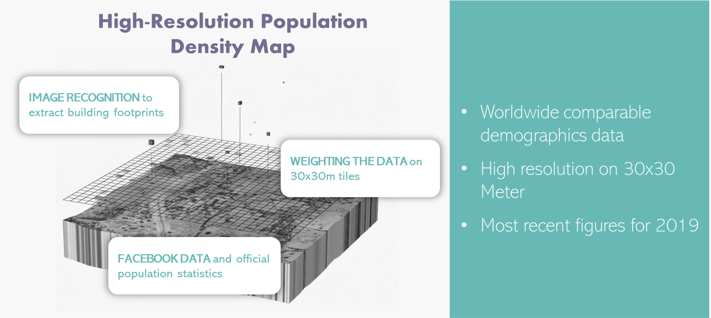

# Population Density

Facebook publishes detailed population data with demographic information under its initiative 
[FACEBOOK Data for Good](https://dataforgood.fb.com/tools/population-density-maps/).
It is one of the most granular data sets about the worldwide population using official census and Facebook data combined 
with image recognition.



The raw data is aggregated in 1-arcsecond blocks (approx. 30x30 m) squares which we transform to H3 bins at 
resolution 11.<br/>
For each bin there is the statistical population value for:
- Total
- Female
- Male
- Children under 5
- Youth 15 - 24
- Elderly 60 plus
- Women of reproductive age 15 - 49

For more general information check out our 
[Medium article](https://medium.com/kuwala-io/querying-the-most-granular-demographics-dataset-62da16b441a8). 

---

## Usage

Those are the command line parameters for setting the geographic scope:

- `--continent` (optional)
- `--country` (optional)

To start the pipeline run:

```zsh
docker-compose run population-density
```

Follow the prompts to download, process and save data [1]

```console
? For which country do you want to download the population data? (Use arrow keys)
 » Albania
   Algeria
   American Samoa
   Andorra
   Angola
   Anguilla
   Antigua And Barbuda
   …
   
? Which demographic groups do you want to include? (Use arrow keys to move, <space> to select, <a> to toggle, <i> to invert)
 » ○ children_under_five
   ○ elderly_60_plus
   ○ total
   ○ men
   ○ women
   ○ women_of_reproductive_age_15_49
   ○ youth_15_24
```

---

## Working with the data

At the moment you can query the data directly using SQL on top of Postgres, or you can process the transformed results 
in Parquet format. We are working on a Jupyter notebook environment where you visualize the data directly and use 
functions to transform the data to your desired aggregation and ultimately send it to your destination. You can follow 
the progress on our [GitHub milestones](https://github.com/kuwala-io/kuwala/milestones) page.

---
### License

We are neither providing nor are we responsible for the population data. This repository is purely a tool for working 
with that data. You are responsible for complying with Facebook's licences when using the data.

Facebook publishes the data under the 
[Attribution 4.0 International (CC BY 4.0)](https://creativecommons.org/licenses/by/4.0/) license.

They recommend the following citation:
> Facebook Connectivity Lab and Center for International Earth Science Information Network - CIESIN - Columbia 
> University. 2016. High Resolution Settlement Layer (HRSL). Source imagery for HRSL © 2016 
> [DigitalGlobe](http://explore.digitalglobe.com/Basemap-Vivid.html). Accessed DAY MONTH YEAR.